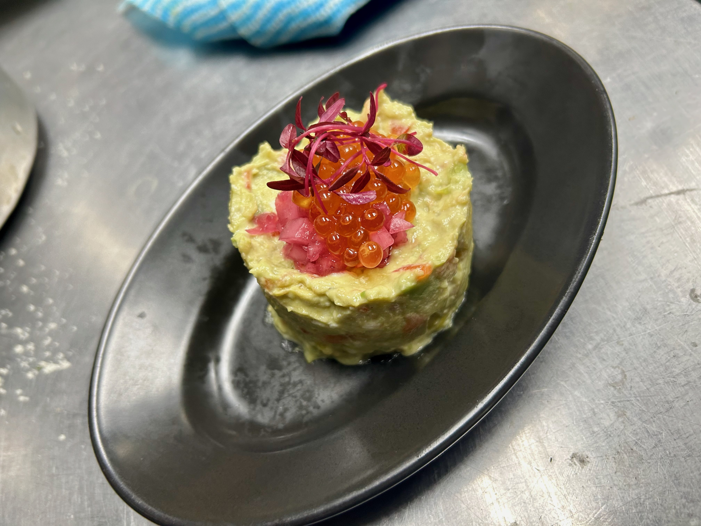
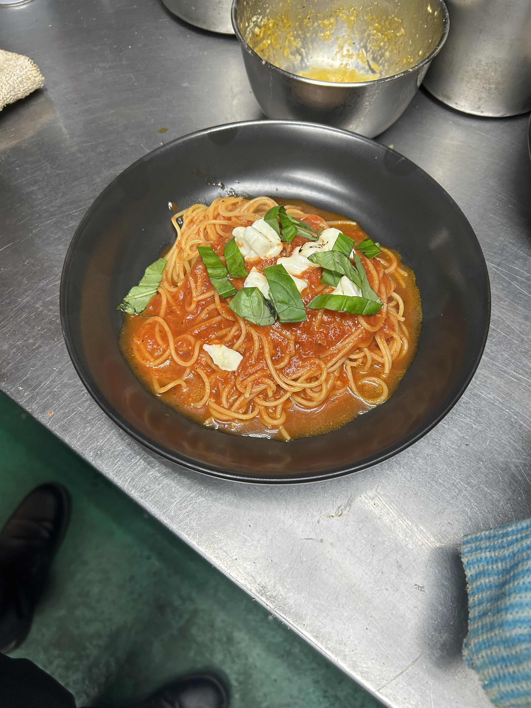

# レシピ一覧 （おいらが作ったことあるやつ）

## 目次

- [モッツァレラサンド](#mozzarella-sand)
- [チキンタルタルサンド](#chicken-sand)
- [BLTサンド](#blt-sand)
- [たまごサンド](#egg-sand)
- [フィッシュタルタルサンド](#fishfry-sand)
- [スモークサーモンサンド](#salmon-sand)
- [プレーンホットドック](#plane-dog)
- [Wホットドック](#w-dog)
- [チリコンカンドック](#chiri-dog)
- [アボカドサーモン](#avocado-salmon)
- [たらこクリームソース](#tarako-cream)
- [揚げ茄子ボロネーゼ](#eggplant-bolognese)
- [シラスとカラスミのペペロンチーノ](#sirasu-karasumi)
- [炙りモッツァレラとポモドーロ](#mozzarella-pomo)
- [チキンオーバーライス](#chicken-rice)
- [タコライス](#taco-rice)
- [オムパスタ](#omu-pasta)
- [バナナガトーショコラ](#banana-chocolate)

---

## モッツァレラサンド {#mozzarella-sand}

### 📷 商品写真  
{width=400px}

### 🧂 1段目  
- モッツァレラ　1枚　ちぎって全面に
 モッツァレラだけ乗っけて20,30秒くらいチン
- バジル
- ケチャップ

### 🍳 2段目  
- ベーコン　2枚
- レタス
- マヨネーズ

### ✅ 手順  
1. 組む
2. 1分半から2分焼く
3. 仕上げにパセリをかける

---

## チキンタルタルサンド {#chicken-sand}

### 📷 商品写真  
{width=400px}

### 🧂 1段目  
- タルタルソース

### 🍳 2段目  
- チキン　2枚
- マスタード

### ✅ 手順  
1. 組む
2. 1分半から2分焼く
3. 仕上げにパセリをかける

---

## BLTサンド {#blt-sand}

### 📷 商品写真  
{width=400px}

### 🧂 1段目 
- ポテトサラダ
- マスタード

### 🍳 2段目
- ベーコン　２枚
- レタス　１面に敷き詰める
- トマト
- マヨネーズ

### ✅ 手順  
1. 組む
2. 1分半から2分焼く
3. 仕上げにパセリをかける

---

## たまごサンド {#egg-sand}

### 📷 商品写真  
{width=400px}

### 🧂 1段目 
- ブルックリンソース

### オムレツの材料
- たまご　２個
- 粉チーズ
- 塩
- 胡椒

### 🍳 2段目
- オムレツ
- マヨネーズ

### ✅ 手順  
1. 組む
2. 1分半から2分焼く
3. 仕上げにパセリをかける

---

## フィッシュタルタルサンド {#fishfry-sand}

### 📷 商品写真  
{width=400px}

###　🐟 最初にすること
## 白身フライを揚げる

揚げるのに時間かかるから

### 🧂 1段目 
- タルタルソース

### 🍳 2段目
- 白身フライ
- マスタード

### ✅ 手順  
1. 白身フライを揚げる 
2. 組む
3. 1分半から2分焼く
4. 仕上げにパセリをかける

---

## スモークサーモンサンド {#salmon-sand}

### 📷 商品写真  
{width=400px}

### 🧂 1段目 
- クリームチーズ　ぬってチン
- アボカド　チンの後

### 🍳 2段目
- サーモン２枚　ちぎって全面に
- レタス
- わさびマヨ

### ✅ 手順  
1. 組む
2. 1分半から2分焼く
3. 仕上げにパセリをかける

---

## アボカドサーモン  {#avocado-salmon}

### 📷 商品写真  
{width=400px}

### 🧂 土台の材料
- カッテージ　20g  
- ダイスアボカド　30g
- ダイスパプリカ  6g
- サーモン  20g
- わさびマヨ 5g
- オリーブ醤油 5cc

### 🍳 トッピングで必要なもの　下から順に
- 土台
- ダイスピクルス赤玉ねぎ 5g
- いくら　ティースプーン1杯
- アマランサス  6本

### ✅ 手順  
1. 土台の材料を全部混ぜてラップでまとめとく <small>１日に3,4個あるといいかも?!</small>

2. 土台を型で整形して上にトッピングを写真のようにセンス!で乗せる
 <small>誰かは言った『才能は開花させるもの、センスは磨くもの』だと...</small>

---

## プレーンホットドッグ  {#plane-dog}
### 📷 商品写真  
{width=400px}

### 🧂　冷蔵庫から取り出すものとその分量
- ロングソーセージ　１本
- ザワークラフト　スプーン1杯
- ピクルスみじん　スプーン1杯

### 🌭 補充の確認が必要なもの
- ドッグパン
- ケチャップ
- マスタード
- パセリ

### ✅ 手順  
1. ドッグパンの真ん中に切り込みを入れる
 <small>割と深くだけど、完全に切り分けないように注意!!
</small> 

- ドッグパンを10秒チン

- ロングソーセージをご飯モード(1分半)で温める

- ドッグパンを30秒オーブンで焼く

- パンの切り込みの中にザワークラフト、ピクルスみじんを塗る

- その上にソーセージを乗っける

- ケチャップとマスタード、最後にパセリをかける

---

## Wーホットドッグ  {#w-dog}

### 📷 商品写真  
{width=400px}

## プレーンホットドッグのソーセージを２本にしただけ！！

### 🧂　冷蔵庫から取り出すものとその分量
- ロングソーセージ　2本
- ザワークラフト　スプーン1杯
- ピクルスみじん　スプーン1杯

### 🌭 補充の確認が必要なもの
- ドッグパン
- ケチャップ
- マスタード
- パセリ

### ✅ 手順  
1. ドッグパンの真ん中を一部削り、切り込みを入れる
 <small>割と深く、だけど完全に切り分けないように注意!!
 </small>

- ドッグパンを10秒チン

- ロングソーセージをご飯モード(1分半)で温める

- ドッグパンを30秒オーブンで焼く

- パンの切り込みの中にザワークラフト、ピクルスみじんを塗る

- その上にソーセージを乗っける

- ケチャップとマスタード、最後にパセリをかける

---

##　チリコンカンドッグ  {#chiri-dog} 

### 📷 商品写真  
{width=400px}

### 🧂　冷蔵庫等から取り出すものとその分量
- ロングソーセージ　１本
- チリコンカン　40g
- ワカモレ　20g
- トマトダイス　5g

### 🌭 補充の確認が必要なもの
- ドッグパン
- トルティーヤ

### ✅ 手順  
1. チリコンカンを小鍋で火にかけて温める
 <small>ふつふつなればOK！</small>
 <small>2,3個分温めといてOK！</small>

- ドッグパンの真ん中に切り込みを入れる
 <small>     割と深くだけど、完全に切り分けないように注意</small>
 

- パンを10秒チン

- ロングソーセージをご飯モード(1分半)で温める

- パンを30秒オーブンで焼く

- パンの切り込みの中にソーセージをはめる

- ソーセージの上に下記を写真のように下から順に センス!で乗っける
    1. チリコンカン
    - ワカモレ
    - トマトダイス
    - トルティーヤ

---

## たらこクリームソース {#tarako-cream}

### 📷 商品写真  
{width=400px}

### 🧂 ソース
- たらこ　  
- マーガリン  たらこと同量
- ハイミー　１振り
- 塩　
- 胡椒
- 生クリーム(現在ラフォルテ)　90のレードル一杯
- お湯　生クリームと同量

### 🍳 トッピング  
- たらこ
- 大葉 3枚　手でちぎる

### ✅ 手順  
1. ソースの原料を全部入れて沸かす　
 <small>沸かしたら火から退ける</small>
  
2. パスタを1分半茹でる。
 <small> 茹でるときにほぐしてあげる</small>
 <small>焦るからソースできてからでもいい</small>  
<small>パスタを冷蔵庫から取る時についでに大葉を冷蔵庫から取り出しておく</small>　
  
3. パスタとソースを絡める。
 <small>スプーン３杯分のソースが残ってたら丁度いいらしい　 見た目意外としゃばい　すぐ蒸発するから</small>
  
4. センスを存分に発揮し盛り付ける
 <small>お皿の側面を見せるように小さくまとめるといい感じになるかも？！</small>

---

## 揚げ茄子ボロネーゼ {#eggplant-bolognese}

### 📷 商品写真  
{width=400px}

### 🧂 1段階目  
<h1>さっさとナス揚げる</h1>
大体3分くらいらしい　狐色が出てくるくらいかなぁ

### 🍳 ソース
- マーガリン
- ナツメグ　1g
- ミートソース　90cc 90のレードル一杯
- お湯　ミートソースと同量

### 🔥 トッピング  
- 粉チーズ
- 揚げた茄子

### ✅ 手順  
1. とにかくナスをあげる  
2. ソースを火にかけて温める　 
  <small>沸かしたら火から退ける</small>
 
3. パスタを1分半茹でる
4. パスタとソースを絡める
 <small>スプーン３杯分のソースが残ってたら丁度いいらしい　 見た目意外としゃばい　すぐ蒸発するから</small>

5. もこみちを宿して盛り付ける
 <small>お皿の側面を見せるように小さくまとめるといい感じになるかも？！</small>

---

## 炙りモッツァレラとポモドーロ  {#mozzarella-pomo}

### 📷 商品写真  
{width=400px}

### 🧂 ソース
- トマトソース　90のレードル一杯
- お湯　トマトソースと同量

### 🍳 トッピング  
- モッツァレラ　<small>盛った後バーナーで炙る</small>
- バジル
- 粉チーズ

### ✅ 手順  
1. ソースの原料を全部入れて沸かす　
 <small>沸かしたら火から退ける</small>
  
2. パスタを1分半茹でる。
 <small> 茹でるときにほぐしてあげる</small>
 <small>焦るからソースできてからでもいい</small>  
<small>パスタを冷蔵庫から取る時についでにバジルを冷蔵庫から取り出しておく</small>　
  
3. パスタとソースを絡める。
 <small>スプーン３杯分のソースが残ってたら丁度いいらしい　 見た目意外としゃばい　すぐ蒸発するから</small>
  
4. センスを存分に発揮し盛り付ける
 <small>お皿の側面を見せるように小さくまとめるといい感じになるかも？！</small>

---

## シラスとカラスミのペペロンチーノ  {#sirasu-karasumi}

### 📷 商品写真  
{width=400px}

###  🧄油に香りを移す段階での材料
- ニンニクスライス　１摘み　<small>意外と多い</small> 
- オリーブオイル　30のレードル一杯
- 鷹の爪

### 🧂ソースを仕上げる材料
- マーガリン　オリーブオイルと同量
- お湯　180cc 90のレードル2杯
- ハイミー
- 塩
- 胡椒

### 🍳 トッピング  
- シラス　20秒くらいチン
- カラスミパウダー

### ✅ 手順  
1. ニンニクと鷹の爪をオリーブオイルであげる　
 <small>ニンニクがきつね色になるくらいまで</small>
  
2. ソースの他の材料を入れて沸かす
 <small>沸かしたら火から退ける</small>
  
3. パスタを1分半茹でる。
 <small> 茹でるときにほぐしてあげる</small>
 <small>焦るからソースできてからでもいい</small>  
 

4. シラスを２０秒チン

5. パスタとソースを絡める。
 <small>スプーン３杯分のソースが残ってたら丁度いいらしい　 見た目意外としゃばい　すぐ蒸発するから</small>
  
5. センスを存分に発揮し盛り付ける
 <small>お皿の側面を見せるように小さくまとめるといい感じになるかも？！</small>

---

## チキンオーバーライス {#chicken-rice}

### 📷 商品写真  
{width=400px}

### 🧂 とりまチン
- ターメリックライス 150g
- ケイジャンチキンスライス半分　180g
 <small>胸肉１枚を半分にしたものという意味らしい すでに半分にされているものがラップされてる</small>
### 🍳 チキン以外のトッピング  
- レタス千切り 20g
- ピクルス 30g
- トマトダイス 30g

### 🔥 チキンにかけるソース  
- ヨーグルトソース
- ハリッサソース

### ✅ 手順  
1. チン

2. 器にライスを盛る
 <small>最終的に器の側面が見えるようにコンパクトに</small>

3. レタスを皿の中央を横断するように帯状に盛る
 <small>タコライスとは違う形だよ〜</small>

4. チンしたチキンを１口大にカットして盛り付ける
5. 残った縁にピクルスとトマトを盛り付ける
<small> ピクルスはまとめて 
トマトは散らばせて</small> 

6. ソースをチキンの上にかける
 sense!
---

## タコライス {#taco-rice}

### 📷 商品写真  
{width=400px}

### 🧂 とりまチン
- ターメリックライス 150g
- ナチョス肉　25g
 <small>こいつは20秒くらいでいい</small>

### 🍳 ナチョス肉以外のトッピング  
- レタス千切り 20g
- アボカド 15g
- トマトダイス 30g
- ミックスチーズ 20g
- 温泉卵

### ✅ 手順  
1. チン

2. 器にライスを盛る
 <small>最終的に器の側面が見えるようにコンパクトに</small>

3. レタス、アボカド、トマト、チーズを全体に盛る
 <small>チキンオーバーライスとは違う形だよ〜</small>

4. チーズを炙る　
 <small>全体炙っちゃっていい</small>
5. 温玉乗っける

---

## オムパスタ {#omu-pasta}

### 📷 商品写真  
{width=400px}

### とにかく最初にハンバーグをチン
冷凍で時間かかるから　3,4分くらい

### 🍳 オムパスタの原料
- 卵　３つ
- ミックスチーズ　15g
- 塩
- 胡椒
- スパゲティ　75g　　
<small>いつものパスタの半分</small>

### オムパスタの上に乗っけるもの
- ハンバーグ
- トマカン
- ミートソース
- ホワイトソース

### ✅ 手順  
1. ハンバーグ、ホワイトソースをチン
 ホワイトソースは1分くらいで取り出す。　
  　
2. パスタを1分半茹でる 　 
3. ミートソースを温めておく  
4. お皿を用意　 <small>ホワイトソースを塗ってみたり</small>
  
5. 頑張ってオムパスタを作る。
  
6. ホワイトソース塗った皿にオムパスタを乗っける
  
7. オムパスタの上にハンバーグ、トマカン、ミートソース、ホワイトソースを乗っける

---

## バナナガトーショコラ {#banana-chocolate}

### 📷 商品写真  
{width=400px}

### 🧂 手順
- バナナをカットして平面部に砂糖かける
- バナナの砂糖を炙る
- ガトーショコラ、生クリーム、キャラメリゼ?!バナナを盛り付ける
 sense!

---

