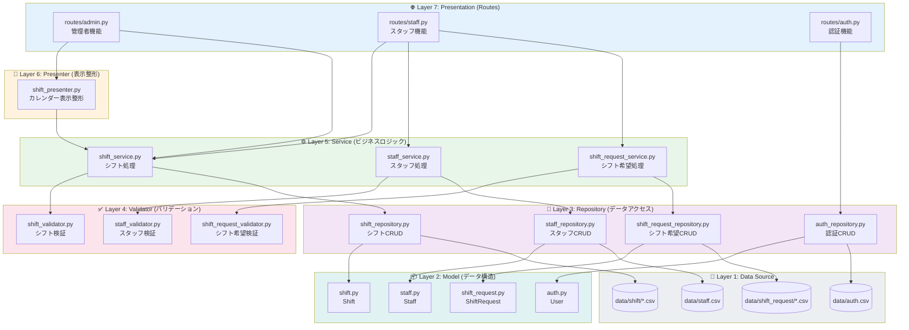
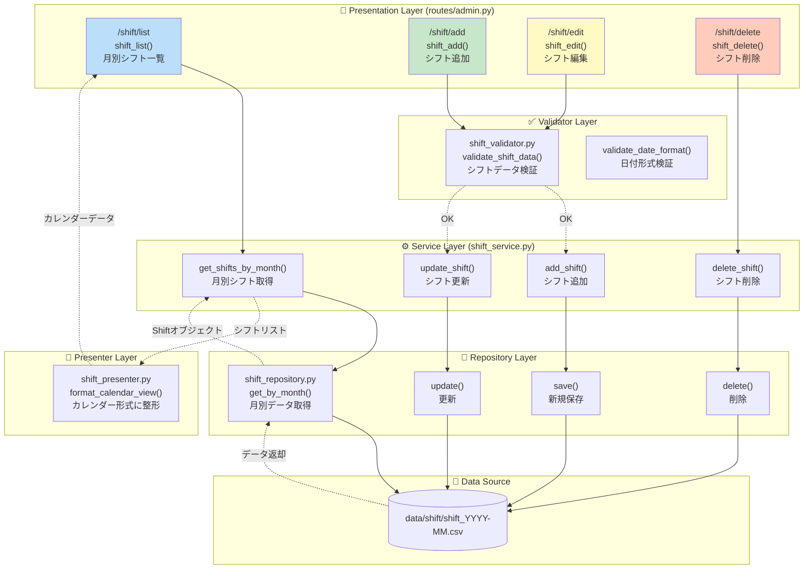
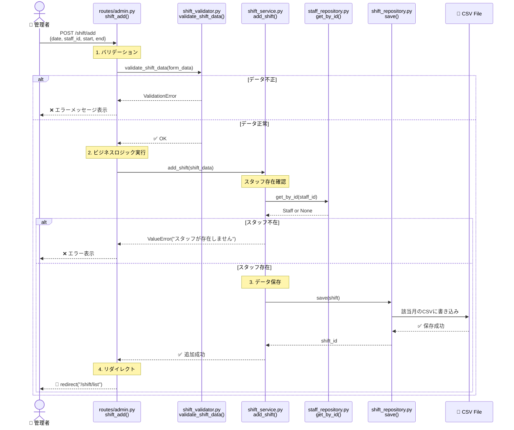
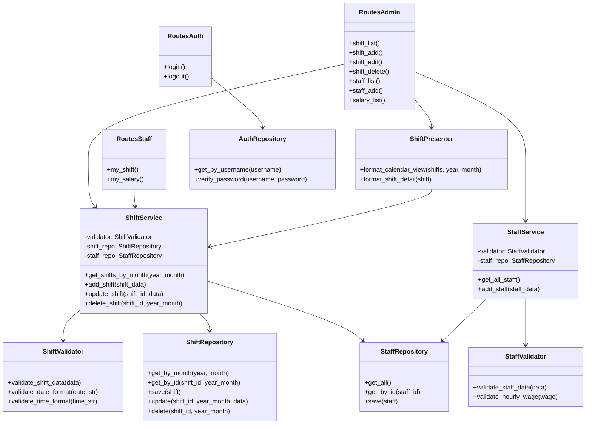
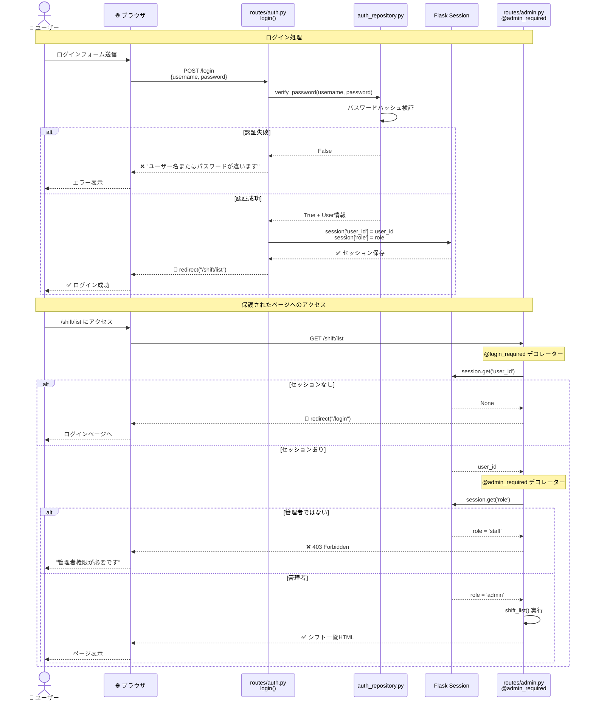

# システム構造図

このドキュメントでは、シフト認証システムの構造と処理フローを視覚的に説明します。

## 目次

1. [レイヤードアーキテクチャ全体図](#レイヤードアーキテクチャ全体図)
2. [シフト管理機能の処理フロー](#シフト管理機能の処理フロー)
3. [シフト追加処理の詳細フロー](#シフト追加処理の詳細フロー)
4. [モジュール依存関係図](#モジュール依存関係図)
5. [認証フローの図](#認証フローの図)

---

## レイヤードアーキテクチャ全体図

このシステムは7層のレイヤードアーキテクチャを採用しています。各レイヤーは下位レイヤーのみに依存します。

**ポイント**:
- 上位レイヤーは下位レイヤーに依存（逆は禁止）
- 各レイヤーは明確な責務を持つ
- Presentationレイヤーは認証デコレーター（`@login_required`, `@admin_required`）で保護

---

## シフト管理機能の処理フロー

シフト一覧表示とシフト追加の処理フローを示します。

**処理の流れ**:
1. **取得**: Routes → Service → Repository → CSV → 逆順で返却 → Presenter → Routes
2. **追加/編集**: Routes → Validator → Service → Repository → CSV
3. **削除**: Routes → Service → Repository → CSV

---

## シフト追加処理の詳細フロー

ユーザーがシフトを追加する際の時系列フローを示します。

**エラーハンドリング**:
- バリデーションエラー → フォームに戻る
- スタッフ不在エラー → エラーメッセージ表示
- CSV書き込みエラー → 500エラー

---

## モジュール依存関係図

各Pythonファイル間の依存関係を示します。

**依存の方向**:
- Routes → Service/Presenter
- Service → Validator + Repository
- Presenter → Service
- Repository → CSV（図示省略）

---

## 認証フローの図

ログインから保護されたページへのアクセスまでのフロー。

**認証の仕組み**:
1. **ログイン**: パスワードハッシュ検証 → セッションに保存
2. **@login_required**: セッション確認 → なければログインページへ
3. **@admin_required**: ロール確認 → 管理者でなければ403エラー

詳細は [`LOGIN_AND_DECORATORS.md`](./LOGIN_AND_DECORATORS.md) を参照。

---

## 補足情報

### ダイアグラムの読み方

| 記号 | 意味 |
|------|------|
| `-->` | 実線矢印（直接呼び出し） |
| `-.->` | 点線矢印（データ返却） |
| `subgraph` | レイヤーやモジュールのグループ |
| `actor` | 人間のユーザー |
| `alt/else/end` | 条件分岐 |

### 関連ドキュメント

- **アーキテクチャ詳細**: [`LAYERED_ARCHITECTURE.md`](./LAYERED_ARCHITECTURE.md)
- **開発ガイド**: [`../getting-started/DEVELOPMENT_GUIDE.md`](../getting-started/DEVELOPMENT_GUIDE.md)
- **認証の仕組み**: [`LOGIN_AND_DECORATORS.md`](./LOGIN_AND_DECORATORS.md)
- **全体構造**: [`APP_STRUCTURE.md`](./APP_STRUCTURE.md)

---

## Mermaid図の編集方法

これらの図はMarkdown内にMermaid記法で記述されています。

- **オンラインエディタ**: [Mermaid Live Editor](https://mermaid.live/)
- **VSCode拡張**: Mermaid Preview
- **GitHub**: 自動レンダリング対応

図を更新したい場合は、このファイルを直接編集してください。
