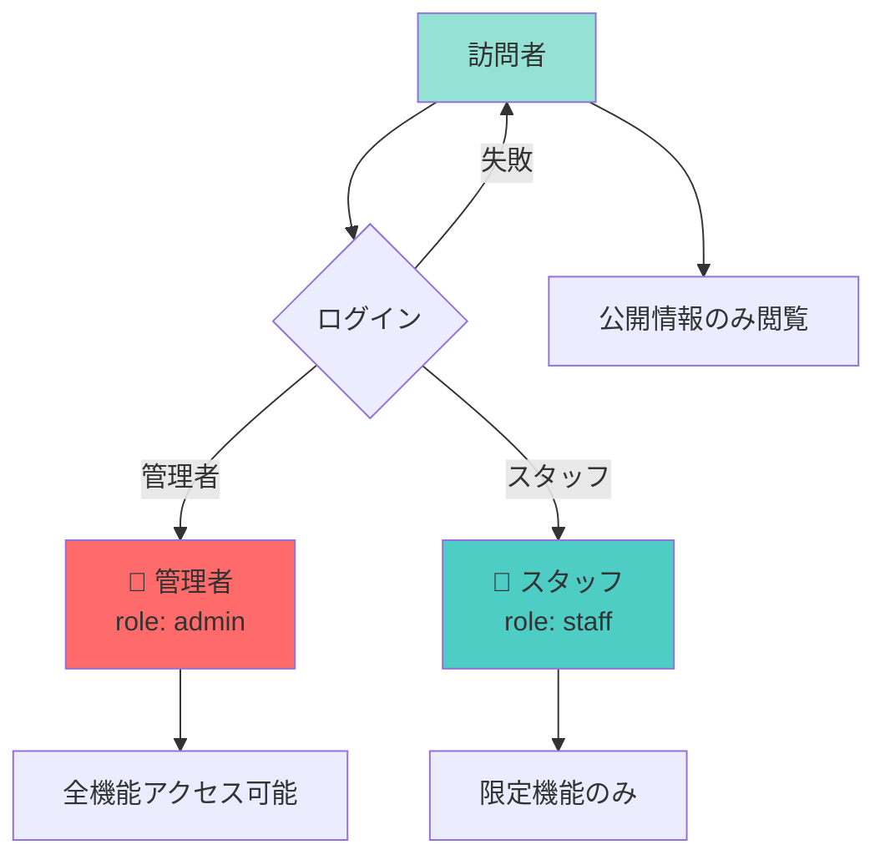
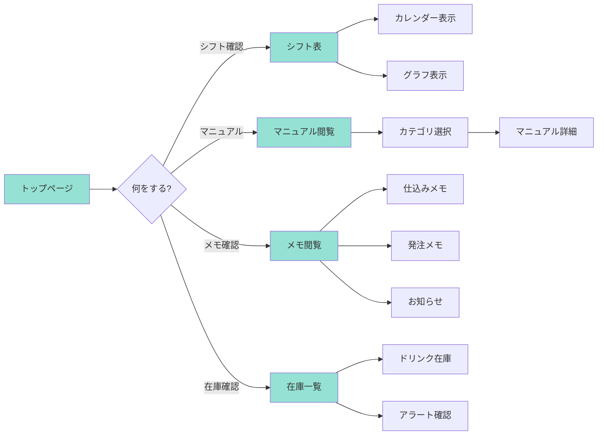
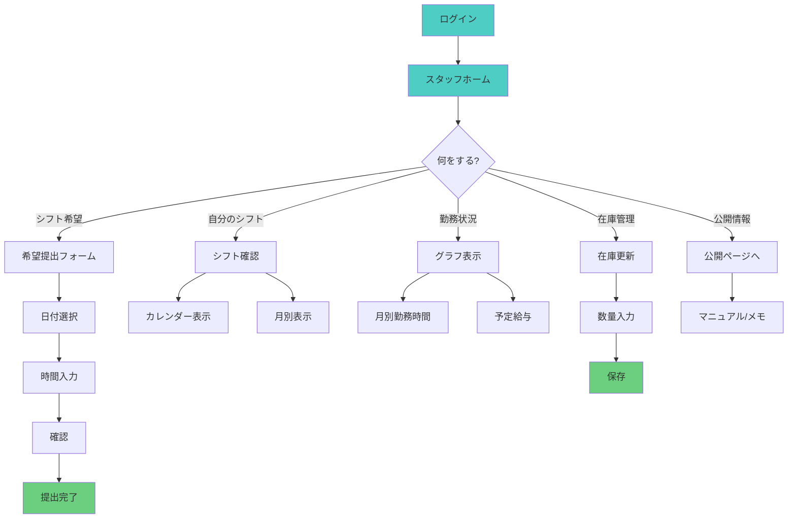
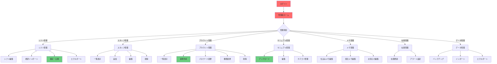
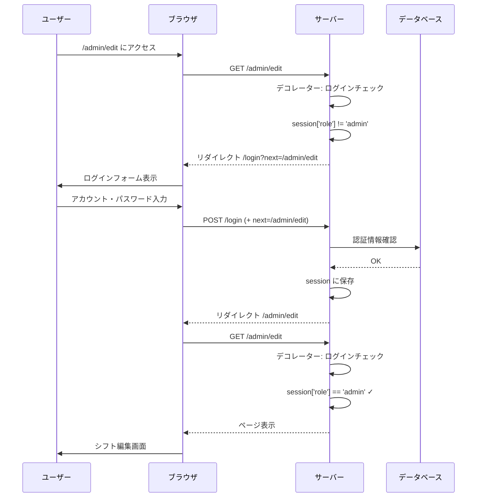
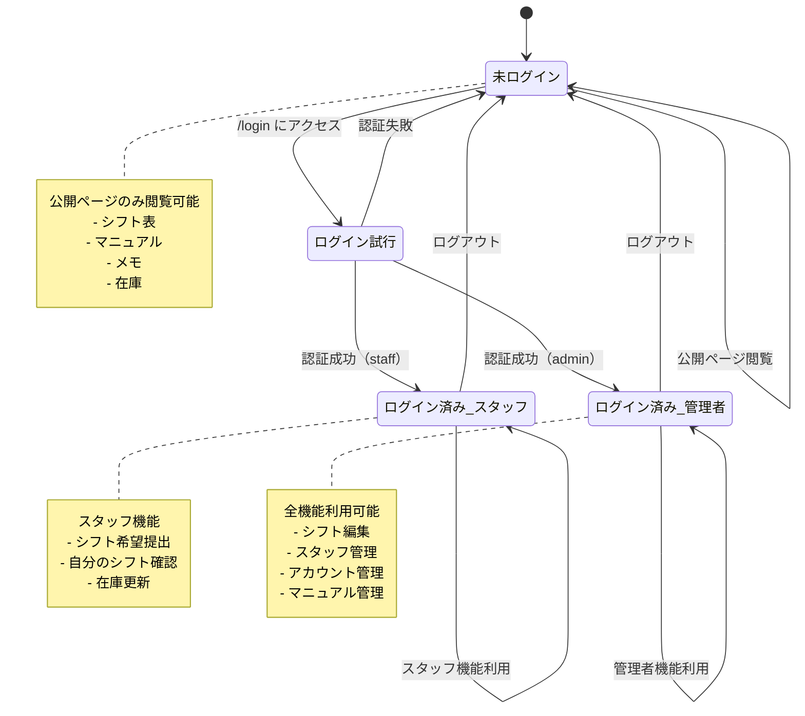
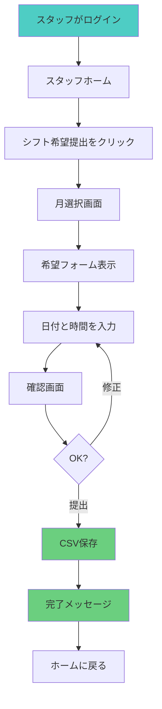
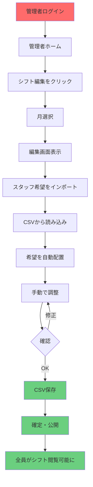
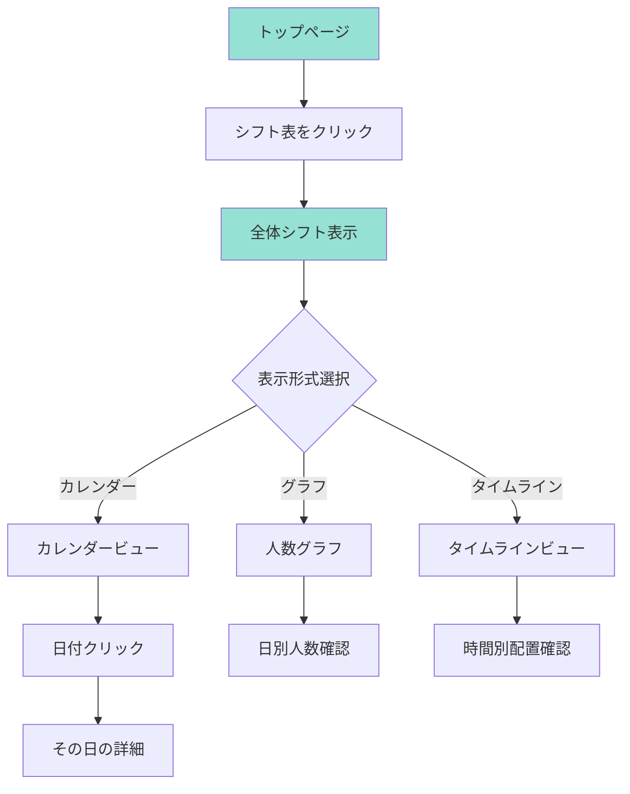

# ユーザーフロー・権限マッピング

**目的**: ユーザーの状態別にできること・ページ遷移を可視化する  
**最終更新**: 2025-12-06

---

## 🎭 ユーザーの種類と権限



---

## 📊 権限マトリクス

| 機能カテゴリ | 機能 | 👤 訪問者 | 👔 スタッフ | 👑 管理者 |
|-------------|------|----------|-----------|----------|
| **認証** | ログイン | ✅ | ✅ | ✅ |
| | ログアウト | - | ✅ | ✅ |
| **シフト閲覧** | 全体シフト表 | ✅ | ✅ | ✅ |
| | 自分のシフト | - | ✅ | ✅ |
| | シフト人数グラフ | ✅ | ✅ | ✅ |
| **シフト管理** | シフト希望提出 | - | ✅ | ✅ |
| | シフト編集 | - | - | ✅ |
| | シフト希望インポート | - | - | ✅ |
| | シフト確定 | - | - | ✅ |
| **スタッフ管理** | スタッフ一覧 | - | - | ✅ |
| | スタッフ追加 | - | - | ✅ |
| | スタッフ編集 | - | - | ✅ |
| | スタッフ削除 | - | - | ✅ |
| **アカウント管理** | アカウント作成 | - | - | ✅ |
| | アカウント削除 | - | - | ✅ |
| | パスワード変更 | - | - | ✅ |
| **業務情報** | マニュアル閲覧 | ✅ | ✅ | ✅ |
| | マニュアル編集 | - | - | ✅ |
| | 仕込みメモ閲覧 | ✅ | ✅ | ✅ |
| | 仕込みメモ編集 | - | - | ✅ |
| | 発注メモ閲覧 | ✅ | ✅ | ✅ |
| | 発注メモ編集 | - | - | ✅ |
| | お知らせ閲覧 | ✅ | ✅ | ✅ |
| | お知らせ編集 | - | - | ✅ |
| **在庫管理** | 在庫確認 | ✅ | ✅ | ✅ |
| | 在庫更新 | - | ✅ | ✅ |
| | 在庫アラート設定 | - | - | ✅ |

---

## 🗺️ ページ遷移図（全体）

```mermaid
graph TB
    Start([トップページ<br/>/]) --> Login{ログイン?}
    
    Login -->|いいえ| PublicArea[公開エリア]
    Login -->|スタッフ| StaffArea[スタッフエリア]
    Login -->|管理者| AdminArea[管理者エリア]
    
    PublicArea --> P1[シフト閲覧]
    PublicArea --> P2[マニュアル閲覧]
    PublicArea --> P3[メモ閲覧]
    PublicArea --> P4[在庫確認]
    
    StaffArea --> S1[シフト希望提出]
    StaffArea --> S2[自分のシフト確認]
    StaffArea --> S3[勤務グラフ]
    StaffArea --> S4[在庫更新]
    
    AdminArea --> A1[シフト編集]
    AdminArea --> A2[スタッフ管理]
    AdminArea --> A3[アカウント管理]
    AdminArea --> A4[マニュアル管理]
    AdminArea --> A5[全データ管理]
    
    P1 --> |ログイン必要な操作| LoginPage[/login]
    P2 --> |編集| LoginPage
    S1 --> |管理者機能| LoginPage
    
    LoginPage --> |認証成功| ReturnPage[元のページ]
    
    style PublicArea fill:#95e1d3
    style StaffArea fill:#4ecdc4
    style AdminArea fill:#ff6b6b
    style LoginPage fill:#ffd93d
```

---

## 🔄 ユーザーフロー（訪問者）



---

## 🔄 ユーザーフロー（スタッフ）



---

## 🔄 ユーザーフロー（管理者）



---

## 📍 エンドポイントマップ（URL別）

### 公開エリア（認証不要）

```mermaid
graph LR
    A[/] --> B[トップページ]
    C[/login] --> D[ログイン]
    E[/shift/view] --> F[シフト表]
    G[/shift/graph/readonly] --> H[グラフ]
    I[/manual/view] --> J[マニュアル]
    K[/manual/memo/kitchen] --> L[仕込みメモ]
    M[/manual/memo/order] --> N[発注メモ]
    O[/manual/memo/notice] --> P[お知らせ]
    Q[/stock] --> R[在庫]
    S[/monthly_shift/YYYY-MM] --> T[月別シフト]
    
    style B fill:#95e1d3
    style D fill:#ffd93d
    style F fill:#95e1d3
    style H fill:#95e1d3
    style J fill:#95e1d3
    style L fill:#95e1d3
    style N fill:#95e1d3
    style P fill:#95e1d3
    style R fill:#95e1d3
    style T fill:#95e1d3
```

### スタッフエリア（ログイン必要）

```mermaid
graph LR
    A[/staff/home] --> B[ホーム]
    C[/staff/submit] --> D[シフト希望提出]
    E[/staff/view] --> F[自分のシフト]
    G[/staff/graph] --> H[勤務グラフ]
    I[/staff/upload] --> J[ファイルアップロード]
    
    style B fill:#4ecdc4
    style D fill:#4ecdc4
    style F fill:#4ecdc4
    style H fill:#4ecdc4
    style J fill:#4ecdc4
```

### 管理者エリア（admin権限必要）

```mermaid
graph TB
    A[/admin/home] --> B[管理者ホーム]
    
    C[/admin/edit] --> D[シフト編集]
    E[/admin/import] --> F[希望インポート]
    G[/admin/export] --> H[エクスポート]
    
    I[/admin/panel] --> J[スタッフ管理]
    K[/admin/add_staff] --> L[スタッフ追加]
    
    M[/admin/accounts] --> N[アカウント管理]
    O[/admin/accounts/create] --> P[アカウント作成]
    Q[/admin/accounts/delete] --> R[アカウント削除]
    
    S[/manual/upload] --> T[マニュアルアップロード]
    U[/manual/upload_image] --> V[画像アップロード]
    
    W[/exclude/api/*] --> X[除外時間API]
    
    style B fill:#ff6b6b
    style D fill:#ff6b6b
    style F fill:#ff6b6b
    style H fill:#ff6b6b
    style J fill:#ff6b6b
    style L fill:#ff6b6b
    style N fill:#ff6b6b
    style P fill:#ff6b6b
    style R fill:#ff6b6b
    style T fill:#ff6b6b
    style V fill:#ff6b6b
    style X fill:#ff6b6b
```

---

## 🔐 認証フロー



---

## 🎯 状態遷移図（ログイン状態）



---

## 🎬 シナリオベースのフロー

### シナリオ1: スタッフがシフト希望を提出



### シナリオ2: 管理者がシフトを作成



### シナリオ3: 訪問者がシフトを確認



---

## 📝 エンドポイント一覧表（詳細版）

| URL | メソッド | 権限 | 機能 | ファイル |
|-----|---------|------|------|---------|
| `/` | GET | 公開 | トップページ | `routes/auth.py` |
| `/login` | GET/POST | 公開 | ログイン | `routes/auth.py` |
| `/logout` | GET | ログイン必要 | ログアウト | `routes/auth.py` |
| `/staff/home` | GET | スタッフ | ホーム | `routes/staff.py` |
| `/staff/submit` | GET/POST | スタッフ | シフト希望提出 | `routes/staff.py` |
| `/staff/view` | GET | スタッフ | 自分のシフト | `routes/staff.py` |
| `/staff/graph` | GET | スタッフ | 勤務グラフ | `routes/staff.py` |
| `/admin/home` | GET | 管理者 | 管理者ホーム | `routes/admin.py` |
| `/admin/edit` | GET/POST | 管理者 | シフト編集 | `routes/admin.py` |
| `/admin/import` | GET/POST | 管理者 | 希望インポート | `routes/admin.py` |
| `/admin/export` | GET | 管理者 | エクスポート | `routes/admin.py` |
| `/admin/panel` | GET | 管理者 | スタッフ管理 | `routes/admin.py` |
| `/admin/add_staff` | GET/POST | 管理者 | スタッフ追加 | `routes/admin.py` |
| `/shift/view` | GET | 公開 | シフト表 | `routes/shift_public.py` |
| `/shift/graph/readonly` | GET | 公開 | グラフ | `routes/shift_public.py` |
| `/manual/view` | GET | 公開 | マニュアル閲覧 | `routes/manual.py` |
| `/manual/upload` | GET/POST | 管理者 | アップロード | `routes/manual.py` |
| `/stock` | GET/POST | 公開 | 在庫管理 | `routes/stock.py` |
| `/stock/alert` | GET | 公開 | アラート | `routes/stock.py` |

---

## 🎯 まとめ

### 図の見方

- 🟢 **緑**: 公開（誰でも見れる）
- 🔵 **青**: スタッフ（ログイン必要）
- 🔴 **赤**: 管理者（admin権限必要）
- 🟡 **黄**: 認証関連

### 活用方法

1. **開発時**: 実装する機能の位置づけを確認
2. **レビュー時**: 権限設定の漏れをチェック
3. **説明時**: 新メンバーへの説明資料
4. **設計時**: 新機能の追加位置を検討

---

**VSCodeで図を表示するには**:
- 拡張機能「Markdown Preview Mermaid Support」をインストール
- このファイルをプレビュー（Cmd+Shift+V）で表示

**GitHubでも自動表示されます**:
- このファイルをプッシュするだけ
- 図が自動的にレンダリングされます

